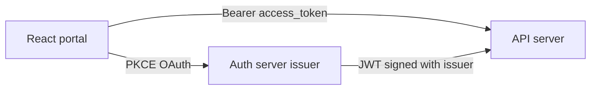

# @uids-io/auth-react

Browser/React OAuth client for [`@advcomm/uids-io-auth`](https://github.com/advcomm/uids-io-auth). Implements the [client SDK contract](../auth/docs/sdk-contract.md): PKCE, device binding, refresh rotation, and SPA logout.

**Minimum server version:** `@advcomm/uids-io-auth` `>=0.1.0`

**Example app:** [`examples/vite-merchant-portal`](./examples/vite-merchant-portal)

**Code documentation:**

- **[Token storage & multi-tab security](./docs/TOKEN_STORAGE.md)** — cookie vs body, rotation, critical behavior
- **[Login providers](./docs/LOGIN_PROVIDERS.md)** — Google / Microsoft / email discovery & `signIn({ provider })`
- [Architecture & module map](./docs/ARCHITECTURE.md)
- **IDE hovers** — JSDoc on `AuthClient`, `AuthReactConfig`, etc. (after `npm run build`)

---

## What this package does

| Component | Role |
|-----------|------|
| **Auth server** (`issuer`) | Runs `@advcomm/uids-io-auth` — login UI, `/authorize`, `/token`, `/refresh`, `/logout`, devices |
| **This SDK** | Your React portal — PKCE redirect, tokens, hooks, API `fetch` helper |
| **API server** (`apiAudience`) | Your backend — validates Bearer tokens via `requireAuth` |



Each portal build has **one** `clientId` + **one** `redirectUri`. All portals share the same `issuer` (and usually the same `apiAudience`).

---

## Install

```bash
npm install @uids-io/auth-react
```

**Peer dependency:** React 18 or 19.

---

## Integration checklist

Use this when wiring a new portal (merchant, agency, admin, etc.):

1. **Register OAuth client** on the auth server (`OAuthClientService.upsertPublicClient`) with this portal’s `redirect_uri` and allowed origin.
2. **Env vars** — `VITE_AUTH_ISSUER`, `VITE_AUTH_CLIENT_ID`, `VITE_AUTH_REDIRECT_URI` (names may differ for CRA/Next).
3. **Callback route** — e.g. `/auth/callback` calls `client.handleCallback()`.
4. **Root** — wrap the app in `<AuthProvider config={...}>`.
5. **Startup** — provider registers device by default (`registerOnMount`).
6. **API client** — Bearer from `getAccessToken()`; on 401 refresh once, else `signIn()` (`createAuthFetch`).
7. **Logout** — `signOut()` (sends refresh token in body; no CSRF cookie needed for SPAs).
8. **CORS** — auth server allows portal `Origin`; API server must allow portal origin in production (or use a BFF/proxy).
9. **Smoke test** — login → protected page → API call → wait/refresh → logout.

---

## Configuration

### Environment variables (Vite)

```bash
# Auth server — where @advcomm/uids-io-auth is mounted
VITE_AUTH_ISSUER=http://localhost:3000

# Unique per portal (must match DB seed / upsertPublicClient)
VITE_AUTH_CLIENT_ID=merchant_portal_web

# Must match an allowed redirect URI for that client
VITE_AUTH_REDIRECT_URI=http://localhost:5173/auth/callback

# Optional: your API base URL (portal → API, not auth)
VITE_API_URL=https://api.example.com
```

### `AuthReactConfig`

| Field | Required | Default | Description |
|-------|----------|---------|-------------|
| `issuer` | Yes | — | Auth server base URL (see below) |
| `clientId` | Yes | — | OAuth public client id for **this** portal only |
| `redirectUri` | Yes | — | Exact callback URL registered on the server |
| `platform` | No | `"web"` | Sent on device register / authorize |
| `appVersion` | No | — | Sent on device register |
| `scope` | No | `openid profile email` | Authorize scope |
| `deviceStorage` | No | `localStorage` | `localStorage` or `indexedDB` for `device_id` |
| `tokenDelivery` | No | `auto` | `auto` → cookie (browser web), `cookie`, or `body` (JSON RT) |
| `tokenStorage` | No | `sessionStorage` | Only when `tokenDelivery: "body"` — where AT+RT persist |
| `apiAudience` | No | — | Client-side hint only; API server enforces audience |
| `refreshSkewSeconds` | No | `60` | Refresh this many seconds before access token expiry |

**`issuer`** is the public URL of the app that hosts `createAuthRouter` (e.g. `https://auth.example.com` or `http://localhost:3000`). It is **not** your business API URL unless you colocate auth and API on one host.

Keep `config` referentially stable (e.g. `useMemo` or module-level constant) so `AuthProvider` does not recreate the client every render.

```ts
import type { AuthReactConfig } from "@uids-io/auth-react";

export const authConfig: AuthReactConfig = {
  issuer: import.meta.env.VITE_AUTH_ISSUER,
  clientId: import.meta.env.VITE_AUTH_CLIENT_ID,
  redirectUri: import.meta.env.VITE_AUTH_REDIRECT_URI,
  platform: "web",
};
```

---

## Portal matrix (local dev)

Seeded by `examples/express-auth-server` in the auth repo:

| Portal | `client_id` | Dev app URL | Default redirect URI |
|--------|-------------|-------------|----------------------|
| Merchant | `merchant_portal_web` | http://localhost:5173 | http://localhost:5173/auth/callback |
| Agency | `agency_portal_web` | http://localhost:5174 | http://localhost:5174/auth/callback |
| Influencer | `influencer_portal_web` | http://localhost:5175 | http://localhost:5175/auth/callback |
| Admin | `admin_portal_web` | http://localhost:5176 | http://localhost:5176/auth/callback |

Adding a 6th portal: register a new public client + redirect URI on the auth server; only env/config changes in the React app.

---

## Step-by-step integration

### 1. Wrap the app

```tsx
import { AuthProvider } from "@uids-io/auth-react";
import { authConfig } from "./auth/config";

export function AppRoot({ children }: { children: React.ReactNode }) {
  return <AuthProvider config={authConfig}>{children}</AuthProvider>;
}
```

`AuthProvider` on mount: restores refresh scheduling, registers the device (unless `registerOnMount={false}`), and exposes session state via `useAuth()`.

### 2. Routing (React Router example)

| Path | Component | Purpose |
|------|-----------|---------|
| `/` | Home | Sign-in button |
| `/auth/callback` | Callback | Exchange `code` for tokens |
| `/dashboard` | Protected | `useRequireAuth()` or manual guard |

See [`examples/vite-merchant-portal/src/App.tsx`](./examples/vite-merchant-portal/src/App.tsx).

### 3. Callback page

After the auth server redirects back with `?code=...&state=...`:

```tsx
import { useEffect, useState } from "react";
import { useNavigate } from "react-router-dom";
import { useAuth } from "@uids-io/auth-react";

export function AuthCallbackPage() {
  const { client } = useAuth();
  const navigate = useNavigate();
  const [error, setError] = useState<string | null>(null);

  useEffect(() => {
    void client
      .handleCallback(window.location.href)
      .then(() => navigate("/dashboard", { replace: true }))
      .catch((e) => setError(e instanceof Error ? e.message : "Sign-in failed"));
  }, [client, navigate]);

  if (error) return <p>{error}</p>;
  return <p>Signing in…</p>;
}
```

`handleCallback`:

- Validates `state` (if stored)
- `POST /token` with PKCE verifier and `X-Uids-Device-Id`
- Stores tokens (access + refresh) per `tokenStorage`
- Clears PKCE verifier from `sessionStorage`

OAuth errors in the query string (`?error=...`) throw `OAuthError`.

### 4. Sign-in and sign-out

```tsx
const { signIn, signOut, isAuthenticated, isLoading, user, error } = useAuth();

// Redirects to auth server /authorize → /login (Google, Microsoft, email, etc.)
await signIn();

// Optional custom OAuth state
await signIn({ state: "checkout" });

// POST /logout with refresh_token; clears local tokens
await signOut();
```

Login UI lives on the **auth server** — the SDK does not embed provider secrets.

### 5. Protect routes

```tsx
import { useRequireAuth } from "@uids-io/auth-react";

export function DashboardPage() {
  useRequireAuth(); // redirects to signIn when not authenticated
  // ...
}
```

Or check `isAuthenticated` / `isLoading` manually for custom UX.

### 6. Call your API

```ts
import { createAuthFetch, useAuth } from "@uids-io/auth-react";

const { client } = useAuth();

const apiFetch = createAuthFetch(
  () => client.getAccessToken(),
  () => client.refresh(),
  {
    onUnauthorized: () => {
      void client.signIn();
    },
  },
);

const res = await apiFetch("https://api.example.com/me");
```

- Attaches `Authorization: Bearer <access_token>`
- On **401**, refreshes once and retries
- `getAccessToken()` refreshes proactively when the access token is near expiry

Your API must use `requireAuth` with the same `issuer` and `audience` (`API_AUDIENCE` on the auth kit) as the auth server.

### 7. Framework-agnostic client

Use `createAuthClient` without React when needed:

```ts
import { createAuthClient } from "@uids-io/auth-react";

const client = createAuthClient(authConfig);
await client.registerDevice();
await client.signIn(); // full-page redirect
// on callback page:
await client.handleCallback(new URLSearchParams(window.location.search));
const token = await client.getAccessToken();
```

---

## Auth server endpoints used

| Method | Path | SDK usage |
|--------|------|-----------|
| POST | `/devices/register` | On startup / before login |
| GET | `/authorize` | `signIn()` redirect (PKCE + `device_id`) |
| POST | `/token` | `handleCallback()` |
| POST | `/refresh` | `refresh()` / scheduled refresh |
| POST | `/logout` | `signOut()` with `{ refresh_token }` |
| GET | `/devices` | `listDevices()` |
| POST | `/devices/revoke` | `revokeDevice()` |

---

## Local development

### 1. Auth server (sibling repo)

From [`docs/auth`](../auth):

```bash
cd ../auth
cp examples/express-auth-server/.env.example examples/express-auth-server/.env
# set DATABASE_URL, ISSUER=http://localhost:3000, API_AUDIENCE=http://localhost:4000, CSRF_SECRET=...
npm install
npm run build
npx tsx examples/express-auth-server/index.ts
```

Listens on **http://localhost:3000** by default. Seeds portal clients including `merchant_portal_web` → `http://localhost:5173/auth/callback`.

### 2. API server (optional, for `/me` demo)

```bash
npx tsx examples/express-api-server/index.ts
```

Listens on **http://localhost:4000**. All routes require Bearer tokens except you call `/me` with a valid access token.

### 3. SDK + merchant example

```bash
cd /path/to/sdk_react
npm install
npm run build

cd examples/vite-merchant-portal
cp .env.example .env
npm install
npm run dev
```

Or from repo root:

```bash
npm run example:merchant
```

Open http://localhost:5173 → **Sign in** → complete login on auth server → dashboard → **GET /api/me** (Vite proxies `/api` → `localhost:4000`).

---

## Security defaults

| Topic | Behavior |
|-------|----------|
| `device_id` | SDK-generated UUID v4 — **no browser fingerprinting** |
| Access token | **Memory only** (short-lived) |
| Refresh token (web) | **HttpOnly cookie** on auth issuer — not readable from JS |
| Multi-tab | Refresh leader (`navigator.locks`) + `BroadcastChannel` |
| `tokenDelivery: "body"` | JSON refresh token in storage (local dev / Flutter web) |
| PKCE verifier | `sessionStorage` until callback, then deleted |

Full detail: [docs/TOKEN_STORAGE.md](./docs/TOKEN_STORAGE.md).

---

## Errors

| Class | When |
|-------|------|
| `OAuthError` | `{ error, error_description }` from auth server |
| `ValidationError` | HTTP 422 with `details[]` |
| `TokenReuseError` | `invalid_grant` with reuse/revoked message — tokens cleared |
| `AuthSdkError` | Other failures |

```ts
import { isOAuthError, isTokenReuseError } from "@uids-io/auth-react";

try {
  await client.refresh();
} catch (e) {
  if (isTokenReuseError(e)) {
    await client.signIn();
  }
}
```

---

## API reference

Full JSDoc (parameters, throws, examples) is on the TypeScript types — open `src/auth-client.ts` or hover `createAuthClient` in your IDE after `npm run build`.

### `createAuthClient(config)` → `AuthClient`

| Method | Description |
|--------|-------------|
| `getDeviceId()` | UUID from storage (creates if missing) |
| `registerDevice()` | `POST /devices/register` |
| `signIn(options?)` | PKCE + redirect to `/authorize` |
| `handleCallback(urlOrParams)` | Exchange code, store tokens |
| `refresh()` | Rotate refresh token |
| `getAccessToken()` | Returns token; refreshes if near expiry |
| `signOut()` | Logout + clear local state |
| `listDevices()` | Authenticated device list |
| `revokeDevice(deviceId)` | Revoke a device |
| `onTokensChanged(cb)` | Subscribe; called immediately with current tokens |
| `initialize()` | Restore refresh timer after load |

### React exports

| Export | Role |
|--------|------|
| `AuthProvider` | Owns `AuthClient`, bootstrap, token subscription |
| `useAuth()` | `isAuthenticated`, `user`, `signIn`, `signOut`, `client`, `error` |
| `useRequireAuth()` | Auto `signIn()` when unauthenticated after load |
| `createAuthFetch()` | Bearer + 401 retry for resource APIs |

### Advanced

- `buildAuthorizeUrl`, `generatePkcePair` — custom redirects or tests
- `OAuthError`, `TokenReuseError`, `ValidationError` — typed errors from auth HTTP

---

## Package development

```bash
npm install
npm run build
npm test
npm run typecheck
npm run check    # biome
```

---

## Roadmap

| Phase | Status |
|-------|--------|
| Phase 1 — Core client + React hooks | Shipped in this repo |
| Phase 2 — Multi-tab refresh leader, portal presets | Planned |
| Phase 3 — `@uids-io/auth-react/next` | Planned |

Details: [REACT_SDK_PLAN.md](../auth/docs/REACT_SDK_PLAN.md)

---

## License

MIT
